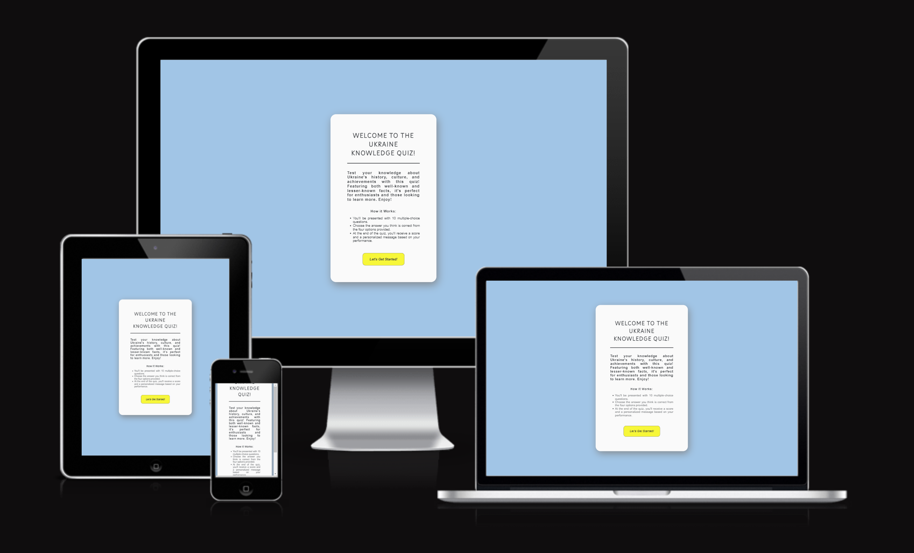

# Ukraine Quiz

## Table of contents

1. [UX](#ux)
2. [Features](#features)
3. [Features Left to Implement](#left)
4. [Technology Used](#tech)
5. [Testing](#testing)
6. [Bugs](#bugs)
7. [Deployment](#deployment)
8. [Credits](#credits)
9. [Content](#content)
10. [Acknowledgements](#acknowledgements)

## Project Description

The Ukraine Quiz is an engaging web application designed to test and expand your knowledge about Ukraine. The quiz presents a series of questions, each with multiple-choice answers. Users can track their score and receive feedback based on their performance.

## UX

The design of the Ukraine Quiz website features colors reminiscent of the Ukrainian flag. The color palette was created using [Coolors.co](https://coolors.co/). The goal of the project is to offer a fun and educational quiz for individuals interested in learning about Ukraine or testing their existing knowledge. The quiz form's design is straightforward and user-friendly, based on sketches made in a notebook rather than detailed wireframes.

## Features

### Existing Features

- **Question Display**: Shows one question at a time from a predefined list of questions.
- **Answer Selection**: Allows users to select an answer from multiple choices.
- **Score Tracking**: Tracks and displays the user's score based on correct answers.
- **Feedback Messages**: Provides feedback based on the user's final score.
- **Responsive Design**: Ensures that the application is usable on various devices and screen sizes.

### Features Left to Implement 

- **Leaderboard**:
- **Timer**:
- **More Questions**:

## Technology Used 

- **HTML**: Provides the structure of the web pages.
- **CSS**: Adds styles to the web pages.
- **JavaScript**: Implements the quiz functionality and interactivity.

## Testing

- **Functionality**: Ensured that the quiz operates as expected, including question display, answer selection, score tracking, and feedback messages.
- **Responsiveness**: Tested on various devices and screen sizes to ensure the application is responsive.
- **Browser Compatibility**: Tested on different web browsers to ensure compatibility.

## Bugs

### Known Bugs

- **Bug**:
- **Resolution**:

## Deployment

The project was deployed using GitHub Pages. The steps to deploy are as follows:

1. **Push the code to the GitHub repository**.
2. **Navigate to the repository settings**.
3. **Select the 'Pages' section**.
4. **Choose the branch to deploy from (usually `main` or `master`)**.
5. **Save the settings**. The site should be live at `https://olala2024.github.io/project-2/`.

## Credits

### Content 

- The questions for the quiz were created by [Olha Burtseva](https://github.com/olala2024).

## Acknowledgements

-
