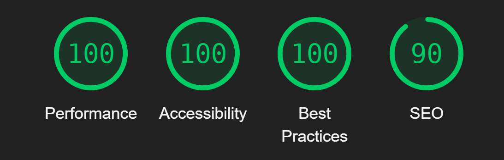

# Ukraine Quiz

## Table of contents

1. [UX](#ux)
2. [Features](#features)
3. [Features Left to Implement](#left)
4. [Technology Used](#tech)
5. [Testing](#testing)
6. [Bugs](#bugs)
7. [Deployment](#deployment)
8. [Credits](#credits)
9. [Content](#content)
10. [Acknowledgements](#acknowledgements)

## Project Description

The Ukraine Quiz is an engaging web application designed to test and expand your knowledge about Ukraine. The quiz presents a series of questions, each with multiple-choice answers. Users can track their score and receive feedback based on their performance.

## UX

The design of the Ukraine Quiz website features colors reminiscent of the Ukrainian flag. The color palette was created using [Coolors.co](https://coolors.co/). The goal of the project is to offer a fun and educational quiz for individuals interested in learning about Ukraine or testing their existing knowledge. The quiz form's design is straightforward and user-friendly, based on sketches made in a notebook rather than detailed wireframes.

## Features

### Existing Features

- **Welcome page with rules**: Displays a welcome message and explains the quiz's purposes and rules.

- **Question Display**: Shows one question at a time from a predefined list of questions.

- **Answer Selection**: Allows users to select an answer from multiple choices.

- **Questions Tracking**: Monitors and shows the user's current question out of the total available.

- **Indication of Correct/Incorrect Answers**: Enhances the quiz experience by providing immediate visual feedback on the user's answer choices. Each selected answer is indicated as correct or incorrect, helping users understand their performance in real-time and learn from their mistakes.

- **Score Tracking**: Tracks and displays the user's score based on correct answers.

- **Feedback Messages**: Provides feedback based on the user's final score.

- **Go Home button**: Navigates back to the welcome page, allowing the user to restart the quiz.

- **Responsive Design**: Ensures that the application is usable on various devices and screen sizes.

### Features Left to Implement 

- **Leaderboard**:

  - Implement a leaderboard to display the top scores of users. This feature will allow users to compare their scores with others, adding a competitive element to the quiz. The leaderboard will be updated in real-time and could include features like user authentication and profiles for a more personalized experience.

- **Timer**:

  - Add a timer for each question to increase the challenge and urgency of the quiz. The timer will count down from a set amount of time (e.g., 30 seconds) for each question. If the time runs out, the question will be marked incorrect, and the next question will be presented. This feature will encourage quick thinking and add an extra layer of difficulty.

- **More Questions**:
  - Expand the question pool to provide a more extensive and varied quiz experience. Adding more questions will reduce repetition for users who take the quiz multiple times. Questions can cover a broader range of topics about Ukraine, including history, culture, geography, and notable figures, ensuring a comprehensive assessment of the user's knowledge.

## Technology Used 

- **HTML**: Provides the structure of the web pages.
- **CSS**: Adds styles to the web pages.
- **JavaScript**: Implements the quiz functionality and interactivity.

## Testing

> [!Note]
> Testing for this project was primarily conducted manually by myself and a few friends to assess website usability, responsiveness, and ensure it is intuitive for completely new users.

- **Functionality**: Ensured that the quiz operates as expected, including question display, answer selection, score tracking, and feedback messages.
- **Responsiveness**: Tested on various devices and screen sizes to ensure the application is responsive.
- **Browser Compatibility**: Tested on different web browsers to ensure compatibility.

## Google Lighthouse Testing

### Desktop

### Mobile

### Validator testing

- HTML
  - No errors were returned when passing all pages through the official [W3C Validator](https://validator.w3.org/nu/?doc=https%3A%2F%2Folala2024.github.io%2FProject-1%2Findex.html)
- CSS
  - No errors were found when passing through the official [W3C CSS Validation service](https://jigsaw.w3.org/css-validator/validator?uri=https%3A%2F%2Folala2024.github.io%2Fproject-2%2F&profile=css3svg&usermedium=all&warning=1&vextwarning=&lang=en)

## Bugs

### Known Bugs

- **Bug**: The result page did not display the feedback message based on the score correctly due to a missed class and a misspelling in an ID.
- **Resolution**: Upon discovering the issue, I identified and corrected the missed class and fixed the misspelling in the ID on the result page. This resolved the issue, and now the feedback message accurately reflects the user's score.

## Deployment

The project was deployed using GitHub Pages. The steps to deploy are as follows:

1. **Push the code to the GitHub repository**.
2. **Navigate to the repository settings**.
3. **Select the 'Pages' section**.
4. **Choose the `main` branch to deploy from**.
5. **Save the settings**. The site should be live at `https://olala2024.github.io/project-2/`.

## Credits

- **Fonts were taken from [Google Fonts](https://fonts.google.com/)**
- **Color pallette created with [Coolors](https://coolors.co/a1c5e6-f7f739-34373b-e1e3e6-fafafa/)**
- **[James Quick](https://www.youtube.com/watch?v=zZdQGs62cR8&list=PLDlWc9AfQBfZIkdVaOQXi1tizJeNJipEx&index=4) - Youtube An engaging tutorial on creating a quiz. I learned a lot from his approach to fetching questions and answers using JavaScript.**
- **[Code Institute](https://codeinstitute.net/de/) - This project was created in alignment with the course content and within the scope of Project 2. The knowledge gained from this course significantly contributed to my understanding and development of the project.**

### Content 

- The questions for the quiz were created by [Olha Burtseva](https://github.com/olala2024).

## Acknowledgements

- I extend heartfelt gratitude to my mentor, Alan Bushell, whose unwavering support, guidance, and invaluable advice have been instrumental in leading me through this project. His expertise and encouragement have profoundly contributed to its success.

- Special thanks to my classmate Ioan, for his invaluable support throughout this project. Ioan provided extensive assistance, particularly in troubleshooting code issues and offering guidance in using IDE tools effectively. I deeply appreciate Ioan's patience, willingness to share knowledge, and consistent support throughout this journey.
